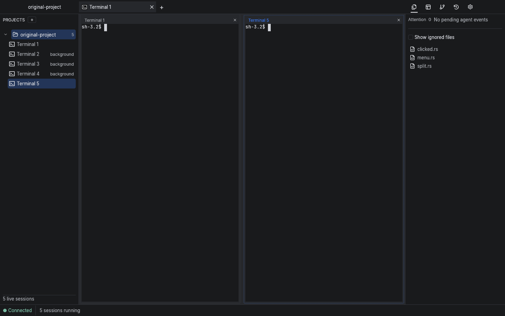
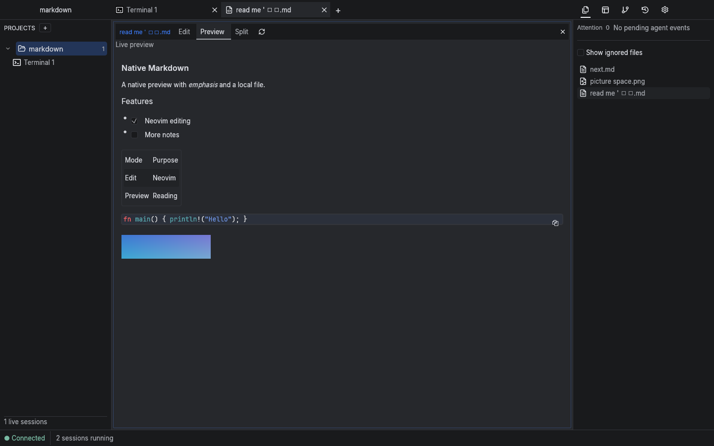
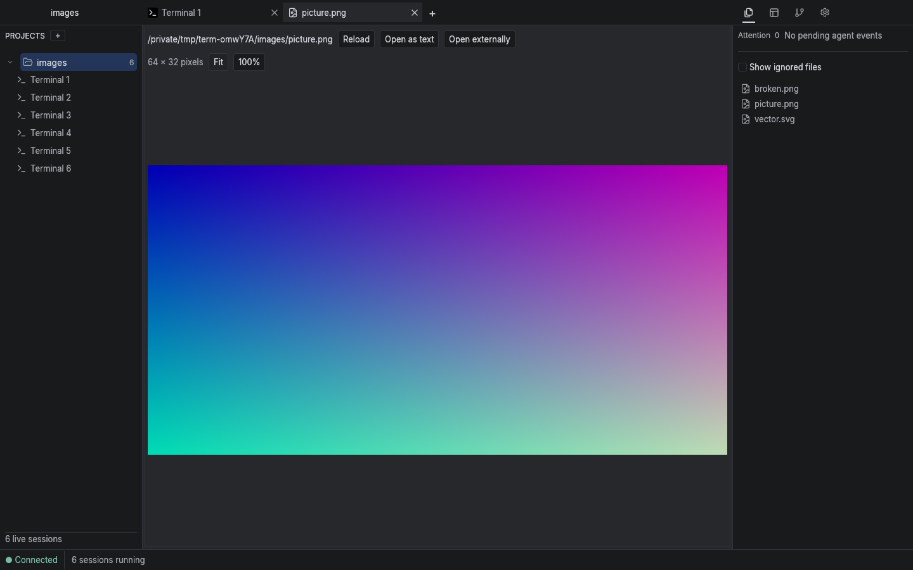

  

<h1 align="center">Terminator</h1>

Your terminals, AI agents, and project files in one place. For macOS and Linux.

**Keep your work together.** Organize projects, work side by side, and return to running terminals after closing the app.

## Features

- **Projects, tabs, and splits** — give each project its own workspace and arrange terminals side by side.
- **Keep work running** — close the app and reconnect to your terminals when you reopen it.
- **AI agent alerts** — see when an agent needs attention or finishes work, with supported agent hooks enabled.
- **Files and editing** — browse project files and open them in Neovim or your preferred editor.
- **Git changes** — see changed files and compare staged or working changes side by side.
- **Markdown previews** — read formatted documents or edit with a live preview beside your text.
- **Image previews** — open images and SVGs, zoom in, or fit them to the window.
- **Terminal search and history** — find text in terminal output and revisit past sessions.
- **Make it yours** — customize colors, fonts, shortcuts, and your shell.

## Get started

1. Follow the [installation and build guide](docs/REFERENCE.md#build-and-run).
2. Add a project folder using **+** beside **Projects**.
3. Open a terminal tab. Right-click a terminal to split your workspace.
4. Click a file to open it, or launch your usual tools in the terminal.

For AI agent alerts, open **Settings → Agent hooks**, enable your agent, then start a fresh agent session inside Terminator. Integrations include Claude Code, Codex, OpenCode, Muse, and Grok; available alerts vary by agent.

Install Neovim for editing inside the app; Git comparisons need Neovim 0.10 or newer. You can also choose an external editor in Settings.

## A closer look

**Read and edit Markdown.** Switch between Edit, Preview, and Split views.

**Preview images.** Open an image from your project without leaving the workspace.

*Screenshots from native app tests using sample projects.*

[Setup and reference](docs/REFERENCE.md) · [Agent setup](docs/INTEGRATIONS.md) · [What's new](CHANGELOG.md) · [Development and testing](scripts/README.md)
